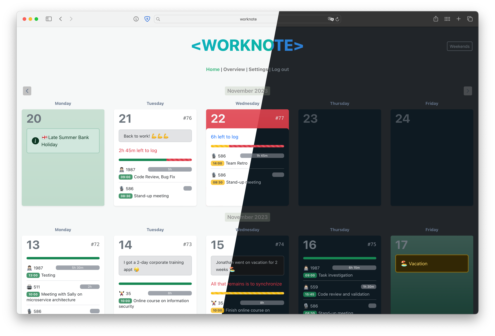
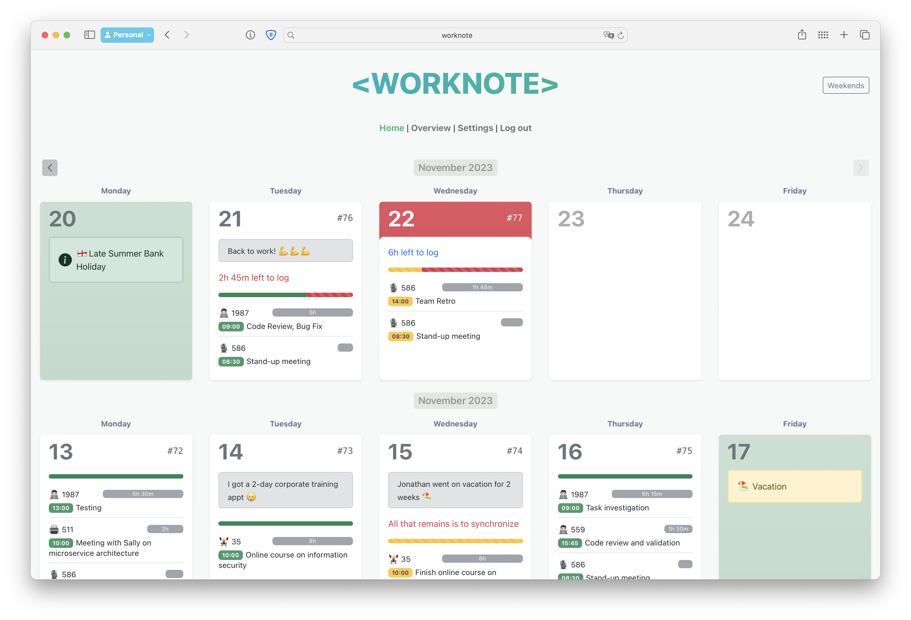
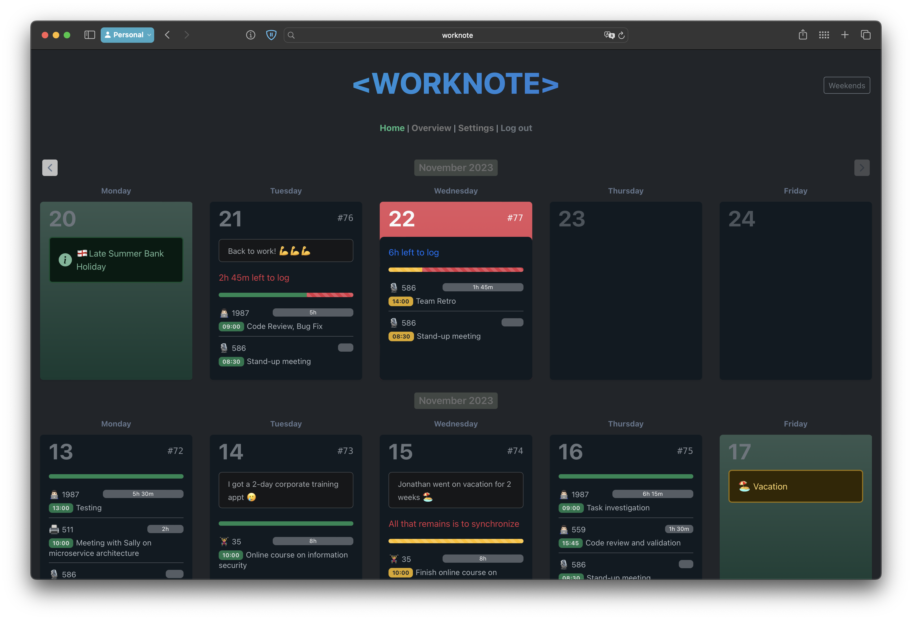

   
  
  <h1>Worknote</h1>

***

Welcome to the **Worknote** repository! 🙂

This project is dedicated to providing a seamless solution
for synchronizing worklogs with a private corporate Jira server.
The system aims to simplify the process of recording work time
into journals, providing a centralized location for managing worklogs
and assisting users with prompts for recurring events and tasks.

***

## 👋 Introduction

At workplaces, it is often required to track and document worklogs in journals or similar systems.
__Worknote__ offers a convenient way to enter worklogs
and effortlessly synchronize them with your private corporate Jira server.
The system provides a unified interface where users can easily manage their work time,
view weekends and reduced working days,
and receive prompts for recurring events and tasks
that require time allocation.

## 🏋️‍♀️ Features

- 🔁 **Synchronization**: Seamlessly synchronize worklogs with your private corporate Jira server.
- 🏛️ **Centralized Management**: All worklogs are stored and managed in a single location, providing easy access and
  organization.
- 🎉 **Weekend and Reduced Working Day Display**: Clearly visualize weekends and reduced working days to effectively plan
  and allocate work time.
- 🗓️ **Production Calendar Integration**: Automatic integration with the production calendar to mark work weeks 
  with local holidays, reduced working days, and rescheduled work days (built-in integration with 🇷🇺&nbsp;Russian calendar).
- ⏳ **Remaining Time Tracking**: Easily view how much time is left to write off for a specific day, ensuring accurate time
  allocation.
- 📆 **Recurring Event and Task Prompts**: Receive prompts for recurring events and tasks that require time allocation,
  ensuring no worklogs are missed.
- 📶 **Workdays Counter**: Keep track of the number of workdays you have already completed in your company or project, 
  providing insights into your overall work progress.
- **Multi-Language Support**: The application offers support for three languages: 🏴󠁧󠁢󠁥󠁮󠁧󠁿&nbsp;English,
  🇪🇸&nbsp;Spanish, and 🇷🇺&nbsp;Russian.
- 🌚 **Dark Theme**: The app features a dark theme option that automatically synchronizes with the system-wide
  dark mode settings.

## 🏗️ Installation

To install **Worknote**, follow these steps:

1. Clone the repository: `git clone https://github.com/e1sordo/worknote`
2. Navigate to the project directory: `cd worknote`
3. Install dependencies: `mvn clean install`

## 🎮 Usage

To use **Worknote**, follow these steps:

1. Ensure you have completed the installation steps.
2. Set required environment variables `export ENV_VAR_NAME=value`
3. Launch the application: `sudo mvn --projects backend spring-boot:start` in detached background mode and run even if
   you close the terminal. Can be stopped with `sudo mvn --projects backend spring-boot:stop`
4. Access the application through your preferred web browser at `http://localhost:8098`.
5. Specify the details to connect to a private enterprise Jira instance using your credentials.
6. Enter your worklogs, taking advantage of the system's features such as weekend and reduced working day display,
   remaining time tracking, and recurring event and task prompts.
7. Click the sync button to synchronize your worklogs with Jira.

## 🎛️ Configuration

Before using **Worknote**, you must configure it by providing the necessary credentials and settings
in the appropriate section of the application.

## 🚪 CORS problem!

This application can be used in two scenarios:
1) Deploy it on your local machine and have access to **Worknote** only from there.
2) Or deploy it on a remote server and have access to **Worknote** from any device.

However, in the second scenario, you may encounter an issue with the corporate Jira server, 
which is located in the company's private network. 
In this case, you won't be able to make requests to Jira from outside your internal network.

To overcome this problem, you can use a special [CORS proxy service](cors-proxy-service) located at the root of this repository. 
It runs as a regular OS-service on your machine with access to Jira and proxies any request from **Worknote** to Jira 
by bypassing the CORS protection.

## 🤝 Contributing

Contributions are welcome! If you'd like to contribute to **Worknote** project, please follow these
guidelines:

1. Fork the repository.
2. Create a new branch: `git checkout -b feature/my-feature`
3. Make your changes and commit them: `git commit -m 'Add new feature'`
4. Push the changes to your branch: `git push origin feature/my-feature`
5. Submit a pull request detailing your changes.

## 🕊️ License

**Worknote** is licensed under the [MIT License](https://opensource.org/licenses/MIT). Feel free
to use, modify, and distribute the software according to the terms of this license.

## 📺 Screenshots

<picture>
  
</picture>  
<picture>
  
</picture>  
<picture>
  
</picture>  
<picture>
  
</picture>
